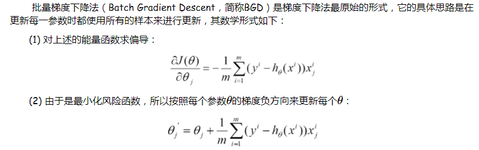

[这篇综述这里面有翻译](http://www.csdn.net/article/2015-06-01/2824811)

## 简介

这篇文章主要介绍了深度学习的以下几个方面：

   监督学习（SGD、神经网络的基本结构）

   反向传播来训练多层神经网络(2006年前后，CIFAR（加拿大高级研究院）把一些研究者聚集在一起，人们对深度前馈式神经网络重新燃起了兴趣。研究者们提出了一种非监督的学习方法，这种方法可以创建一些网络层来检测特征而不使用带标签的数据，这些网络层可以用来重构或者对特征检测器的活动进行建模。)

   卷积神经网络

   分布式特征表示与语言处理

   递归神经网络RNN

   深度学习展望（1、无监督学习对于重新点燃深度学习的热潮起到了促进的作用，但是纯粹的有监督学习的成功盖过了无监督学习。在本篇综述中虽然这不是我们的重点，我们还是期望无监督学习在长期内越来越重要。2、在未来几年，自然语言理解将是深度学习做出巨大影响的另一个领域。我们预测那些利用了RNNs的系统将会更好地理解句子或者整个文档，当它们选择性地学习了某时刻部分加入的策略。）
    
 深度学习的理解：
 
 
 
 

 
 
 从上面3张图片可以看出来，网络的第一层的到的是一些边缘信息，第二层的就是右边缘信息组合起来更加具体的信息（如果人脸的话就是一些器官），到后面更加详细（得到人脸）。
 
 
 下面是对本文献一些基础知识的理解：
## 梯度下降法总结：
 
### 方向导数和梯度的概念
    
   方向导数：是一个数；反映的是f(x,y)在P0点沿方向v的变化率。
   梯度是一个向量；既有大小，也有方向。梯度的方向就是函数f(x,y)在这点增长（往正方向）最快的方向，梯度的模为方向导数的最大值。
    
### 梯度下降法的三种形式BGD、SGD以及MBGD
  
  [参考网页](http://www.cnblogs.com/maybe2030/p/5089753.html)
  
##### 批量梯度下降法BGD
  
  
  
  
  
##### 随机梯度下降法SGD
  
  
  
  
##### 小批量梯度下降法MBGD
  
   
   
### 反向传播算法

  [参考网页](http://www.cnblogs.com/charlotte77/p/5629865.html)
  
  
  
  
### CNN
  
  
  CNN主要弄清楚下面几个概念：卷积  池化  ReLu Layer  全连接 
  
  
 
 卷积网络结构都是尺寸越来越小，但是越来越厚，如果输入为RGB图片，那么输入时的厚度就是3。
  
  两个重要的网站
  
  [CNN笔记：通俗理解卷积神经网络](http://blog.csdn.net/v_JULY_v/article/details/51812459)
  
  [卷积神经网络CNN究竟是怎样一步一步工作的？](http://www.jianshu.com/p/fe428f0b32c1)
  
  再结合下面几张图片理解：（来自莫凡 tensorflow）
  
  
  
  
 
 卷积网络结构都是尺寸越来越小，但是越来越厚，如果输入为RGB图片，那么输入时的厚度就是3。
 
 卷积网络结构都是尺寸越来越小，但是越来越厚，如果输入为RGB图片，那么输入时的厚度就是3。
 
 卷积网络结构都是尺寸越来越小，但是越来越厚，如果输入为RGB图片，那么输入时的厚度就是3。
  
### 分布式特征表示
  
  论文中：下面是一个很好的示范例子，比如将本地文本的内容作为输入，训练多层神经网络来预测句子中下一个单词。
  
### RNN
  
  RNNs被发现可以很好的预测文本中下一个字符或者句子中下一个单词，并且可以应用于更加复杂的任务。
  采用了特殊隐式单元的LSTM（long short-termmemory networks）被首先提出，其自然行为便是长期的保存输入。LSTM网络随后被证明比传统的RNNs更加有效，尤其当每一个时间步长内有若干层时，整个语音识别系统能够完全一致的将声学转录为字符序列。
  
### 总结：

  无监督学习对于重新点燃深度学习的热潮起到了促进的作用，但是纯粹的有监督学习的成功盖过了无监督学习。在本篇综述中虽然这不是我们的重点，我们还是期望无监督学习在长期内越来越重要。无监督学习在人类和动物的学习中占据主导地位：我们通过观察能够发现世界的内在结构，而不是被告知每一个客观事物的名称。
  在未来几年，自然语言理解将是深度学习做出巨大影响的另一个领域。我们预测那些利用了RNNs的系统将会更好地理解句子或者整个文档，当它们选择性地学习了某时刻部分加入的策略。


  
### Markdown（这样的格式适合用来写代码）

Markdown is a lightweight and easy-to-use syntax for styling your writing. It includes conventions for

```markdown
Syntax highlighted code block

# Header 1
## Header 2
### Header 3

- Bulleted
- List

1. Numbered
2. List

**Bold** and _Italic_ and `Code` text

[Link](url) and 
```

For more details see [GitHub Flavored Markdown](https://guides.github.com/features/mastering-markdown/).

